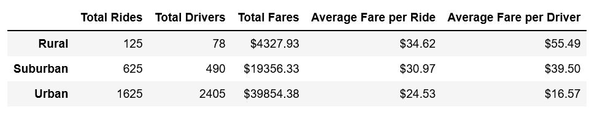
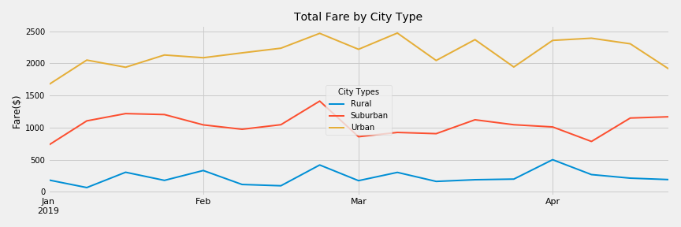

# PyBer_Analysis

Analysis on PyBer rideshare data from January to early May 2019.

# Findings and Analysis

This report provides the analysis of PyBer's rideshare data from January to early May of 2019 and create a compelling visualization to show the findings. The purpose of this analysis is to improve PyBer to access to ridesharing services and determine affordability for under-serviced neighborhood. For this purpose, we created a summary talbe for total rides, drivers and fares, and average fare per ride and average fare per driver in three city types. We also created a line chart for weekly average fares for three city types.

## Summary Table

## Weekly Average Total Fares by City Type

## Findings

- Total Rides, Drivers and Fares
  - Urban city type has most total rides, drivers and fares.
  - Rural city type has least total rides, drivers and fares.

- Average Fare per ride and Average Fare per Driver
  - Urban city type has lowest average fare per ride and average fare per driver.
  - Rural city type has highest average fare per ride and average fare per driver.

- Weekly Average Total Fares by City Type
  - Urban city type has highest weekly average total fares and distributes between $1,600 to $2,500.
  - Rural city type has lowest weekly average total fares and distributes between $60 to $ 502.

## Analysis

The above findings show that althogh rural city type has lowest level of total rides, total riders, total fares and weekly average total fares, there is a potential for ride-sharing services in this underserved neighborhood because We found that this city type has highest average fare per ride and average fare per driver. This means customers in rural city type has the affordability for ride-sharing services. 

# Challenges and Difficulties

